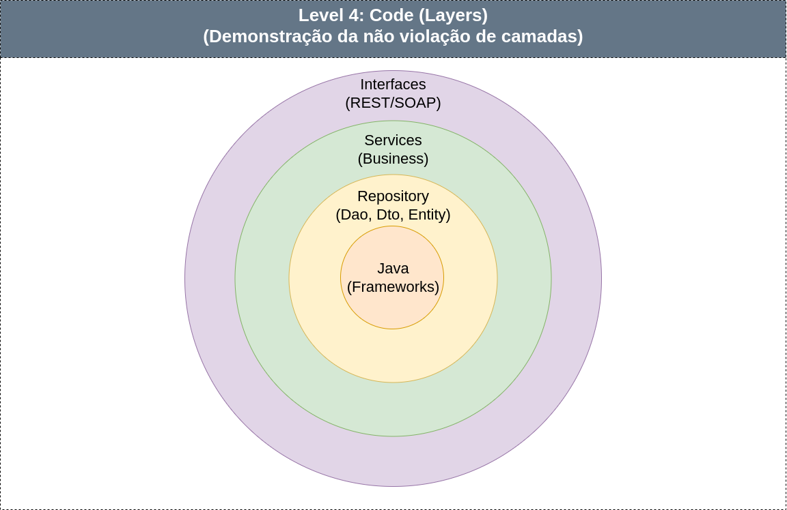

# backend-java Project

introdução amigavel

## Pré requisitos

 - Não possuir aplicações rodando na porta 8080, verifique  como matar aplicações rodando na porta 8080 de acordo com seu sistema operacional.

    caso esteja em uma arquitetura linux pode executar os comandos abaixo para verificar e matar processos em 8080. 
```sh script
linux:
    $ netstat -anop | grep 8080
    $ kill -9 <pid>
```

 - Possuir o JDK 11 instalado.

 - Banco de dados IRIS esteja funcinando corretamente. Executando: 

```sh script
    docker ps 
```

E verifique se o conteiner `intersystems-iris-iris` está up e com status `(healthy)`.

## Inicializando sistema

Primeiro execute para instalar dependencias do maven:

```sh script
    ./mvnw install
```

Após isso, execute para iniciar a aplicação:

```sh script
    ./mvnw clean quarkus:dev
```
## Arquitetura

O presente sistema tem uma arquiterura em cebola, onde camadas mais profundas não acessão camadas mais superficiais. 



### Camadas
 - JAVA (Frameworks): Recursos e frameworks JAVA. 
 - Repository: Conjunto de recursos e elementos responsáveis pelo tratamentos e persistencia dos dados.
   - Entity: Mapeamento das tabelas do banco de dados.
   - Dao: Classes responsáveis por manipular e persistir as Entidades.
   - Dto: Classes responsáveis por transferir dados entre as camadas, não possui conexão com banco de dados.
 - Services: Classes responsáveis pela aplicação e manipulação de Repository para aplicação de regras de negócio. 
 - REST/SOAP: Endpoits e rotas. (recursos externos)
