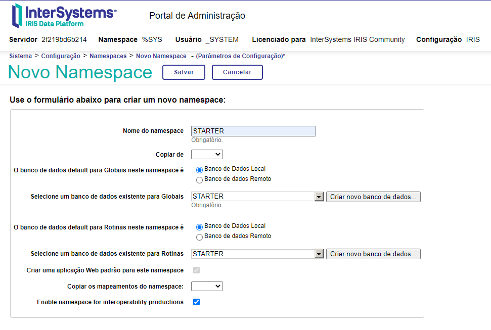
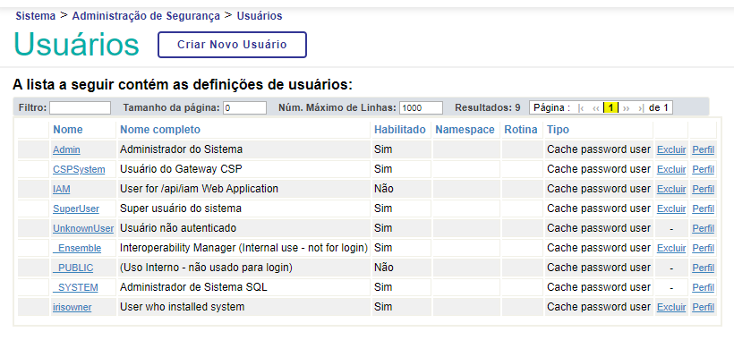
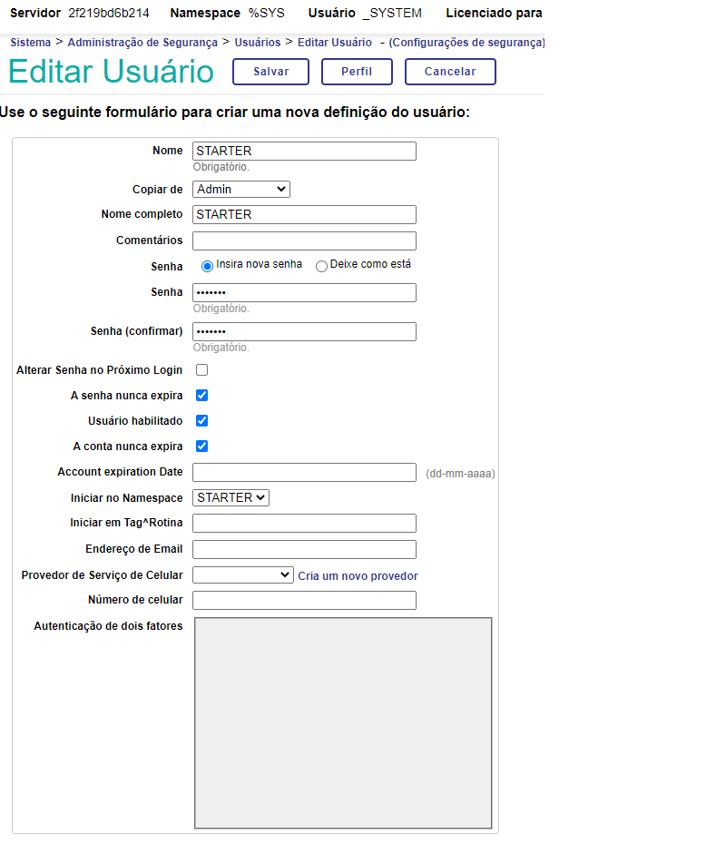
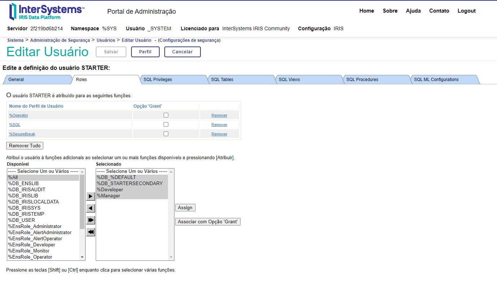

# Manutenção servidor IRIS
## Criando uma namespace
- Acesse o portal local:  http://localhost:53773/csp/sys/%25CSP.Portal.Home.zen
- Acesse Sistema > Configuração > Namespaces > Criar novo namespace
- Preencha os dados do namespace:

## Manutenção de usuários

No portal de administração, acesse Sistema > Administração de Segurança > Usuários para visualizar os usuários existentes e seus direitos de acesso

Ao criar um novo usuário, para facilitar copie os direitos de acesso de um usuário existente

Na edição do usuário é possível definir os direitos de acesso, para adicionar uma nova função ao usuário selecione na lista, e clique no botão aplicar

Para mais detalhes [Documentação Intersystem contas de usuário](https://docs.intersystems.com/irislatest/csp/docbook/DocBook.UI.Page.cls?KEY=GAUTHZ_users)
